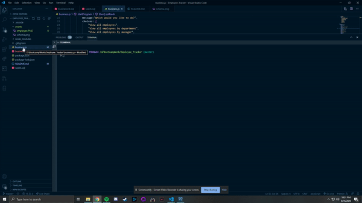
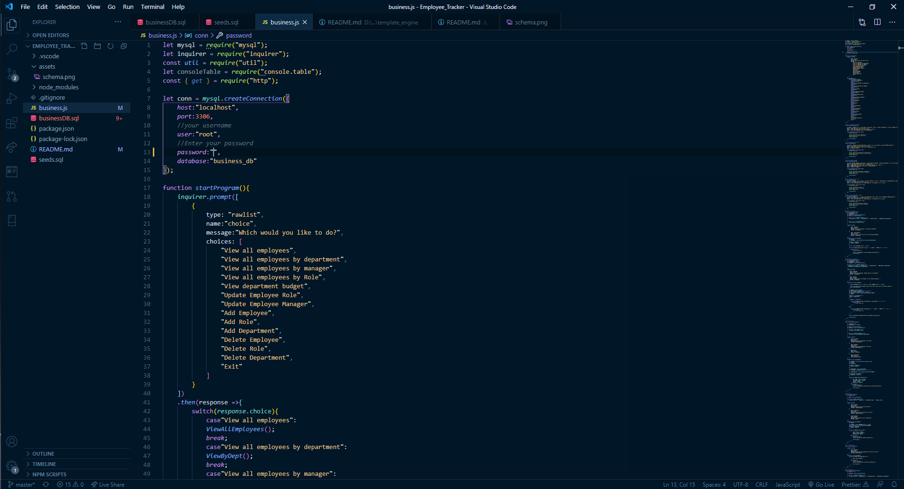

# Employee_Tracker

# Table of Contents

* [Process](#Process)
* [Issues](#Issues)
* [Video](#Video)
* [Link](#Link)
* [Screenshot](#Screenshot)

# Process

First clone project from GitHub.

Next open the command line directly to the file business.js.

Next type in: node business.js and press enter.

Next is user choice on how they want to enter or delete information.

WHen done press the exit option to end the adding or deleting information from the SQL tables.

# Issues

This project was more time consuming than anticipated.

Created many functions to operate a simple choices and table to create the information provided.

Many new things I had to learn to utilize all function together.

Using async and await was a tough thing at first but when using on multiple functions

the idea was better understood.

made alot of small errors dealing with over 600 lines of code that I had to 

go back and fix to stop the errors from popping up.

# Video

* [Link to video demo](https://drive.google.com/file/d/1JTfUeY7kNf9CojC9ySce7pWOTnlG09Ox/view?usp=sharing)

# Link

No link needed for this project but provided a video link how to operate the command line.

# Screenshot

